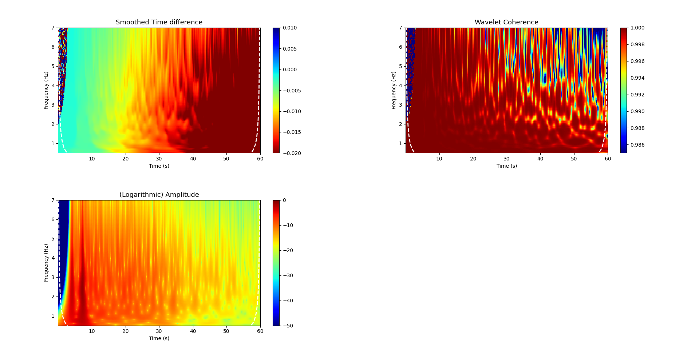

## CODE for MEASURING SEISMIC TRAVEL-TIME CHANGES with the WAVELET METHOD
### This python program is based on the work of Mao and Mordret, that you can find here : https://github.com/shujuanmao/dt-wavelet
### The original code was in MATLAB, and here is the Python equivalent
#### Contact : Higueret Quentin (quentin.higueret@univ-grenoble-alpes.fr) and Aurélien Mordret (aurelien.mordret@univ-grenoble-alpes.fr)

This package contains codes and test data for measuring seismic travel-time shifts in the time-frequency domain using the wavelet cross-spectrum analysis. 
## Requirements
All the files must be in the same folder when you launch the program

Python 3 and the PyCWT packages from https://github.com/regeirk/pycwt are needed to run the codes

You can use pip to install this package :

    $ pip install pycwt

## Contents in this package

* **xwt.py** <br/><br/>
  The core function to calculate dt in the time-frequency domain by wavelet cross-spectrum analysis.

* **plotting_example.py** <br/><br/>
  An example of using the xwt function on synthetic data. Plots come with one click.

* **ori_waveform.npy** <br/>
  **new_waveform.npy** <br/><br/>
  Two synthetic waveforms for testing the codes, ori_waveform and new_waveform <br/>
  The synthetic seismograms are generated using velocity models by a homogeneous background superimposed with random heterogeneities.<br/>
  The perturbation between the current and reference velocity models is a 0.05% homogeneous dv/v throughout the medium. (If interested, see Section 3.1 in the following reference for more details.)
    
* **time.npy**<br/>
  **fs.npy** <br/><br/>
  The time vector and sampling frequency associated with the synthetic waveforms
  
## Usage
```
WXamp, WXspec, WXangle, Wcoh, WXdt, freqs, coi = xwt(trace_ref,trace_current,fs,ns,nt,vpo,freqmin,freqmax,nptsfreq)
```
* **Input**<br/><br/>
  trace_ref,trace_current : Two vectors, reference and current time series.<br/>
  fs : Sampling Frequency // Positive scalar, sampling frequency.<br/>
  ns : NumScalesToSmooth // Positive integer, indicating the length of boxcar window.<br/>
  nt : DegTimeToSmooth // Positive scalar, indicating the length of the Gaussian window.<br/>
  vpo : VoicesPerOctave //  Even integer from 4 to 48, indicates how fine the frequency is discretized.
                             Should be no less than 10.<br/>
  freqmin : The starting value of the frequency vector, in Hz.<br/>
  freqmax : The ending value of the frequency vector, in Hz.<br/>
  nptsfreq : Number of frequency samples to generate between the starting and ending value.

* **Output**<br/><br/>
  WXamp : Matrix of amplitude product of two CWT in time-frequency domain.<br/>
  WXspec : Complex-valued matrix, the wavelet cross-spectrum.<br/>
  WXangle : Matrix of the angle of the complex argument in WXspec.<br/>
  Wcoh: Matrix of wavelet coherence.<br/>
  WXdt : Matrix of time difference and phase difference, respectively
         between the two input time series in time-frequency domain.<br/>
  freqs : Vector of frequencies used in CWT, in Hz.<br/>
  coi : Cone of influce. Vector of the maximum period of useful information at each arrival time.<br/>
  Note that here coi means MAX PERIODS, in Matlab codes it refers to MIN FREQUENCY.
  
## Plotting Example

Using the xwt function and the synthetic data, we can perform a cross-wavelet transform. <br/>
This is the plot we obtain using the **plotting_example.py** program :

<p align="center">
  
</p>

(If interested, compare the image obtain here with the **Figure 3** in this article Geophysical Journal International, Volume 221, Issue 1, April 2020, Pages 550–568, https://doi.org/10.1093/gji/ggz495)

## Coming soon

Implementation of the cone of influence for each frequency bands

## Reference 
S.Mao, A.Mordret, M.Campillo, H.Fang, R.D.van der Hilst, (2019), On the Measurement of Seismic Travel-Time Changes in the Time-Frequency Domain with Wavelet Cross-Spectrum Analysis, GJI.<br/><br/>
Torrence, C. and Compo, G. P.. A Practical Guide to Wavelet Analysis.


